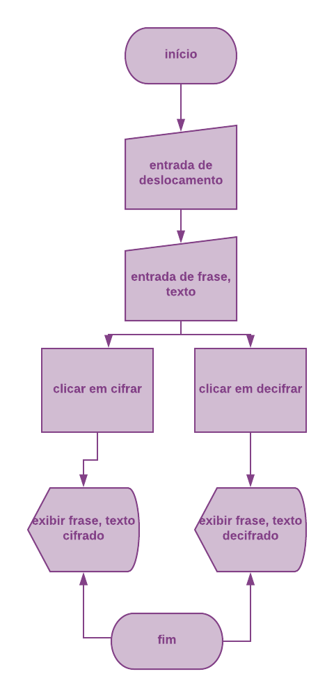

# Cifra de César

## Prefácio

O aniversário da sua mãe está se aproximando e você está organizando uma festa
surpresa. Para manter a festa em segredo foi criado um grupo de Whatsapp com
amigxs e familiares. O problema é que as vezes sua mãe utiliza o seu celular
e pode ser que ela veja as suas mensagens. Como a festa é surpresa, você
decide criar uma aplicação que permita enviar mensagens criptografadas e depois
descriptografar. 

## Objetivos
Foi feito uma aplicação funcional que cifra, decifra e fácil de usar para atender as 
pessoas que queiram usar sem complicações.  
    Ela permite que o usuário digite um texto com letras maiúsculas ou minúsculas para ser
cifrado e decifrado. 
    Permite também que o usuário escolha o descolamento das letras, inclusive descolamento
negativo!

## Diagrama feito para o produto:

